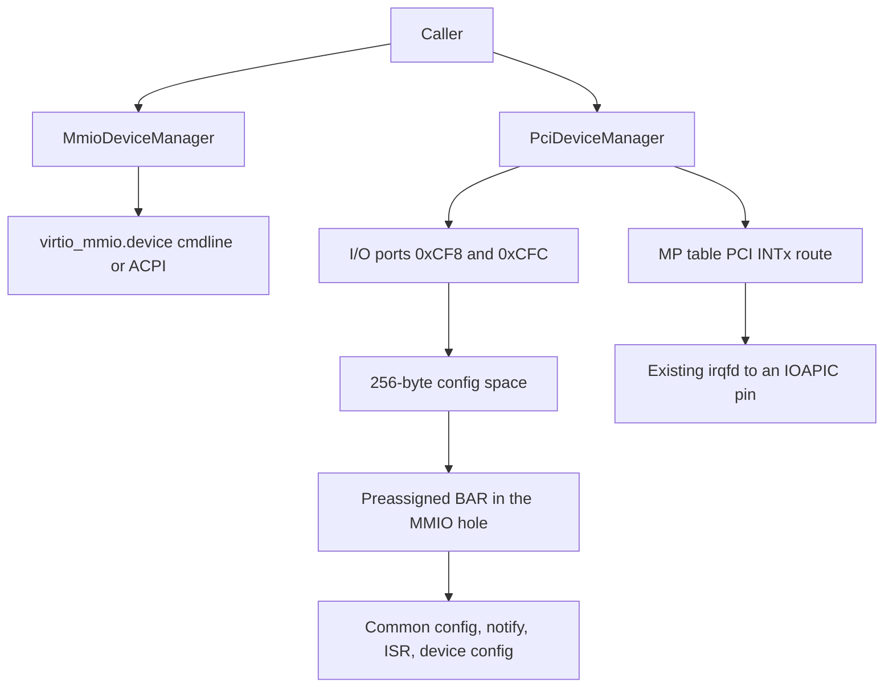

# Virtio-PCI transport

Draft plan. MMIO remains the default. Callers opt into PCI by attaching devices through a new manager instead of [`MmioDeviceManager`](../src/libkrun/src/api/device_builders.rs). The device objects (console, fs, vsock, net, and the rest) stay on [`VirtioDevice`](../src/devices/src/virtio/device.rs); only the transport wrapper changes.

Scope is the path [`examples/chroot_vm.c`](../examples/chroot_vm.c) actually boots: x86_64 Linux KVM, ACPI off, in-kernel irqchip. `PciDeviceManager` exists on every build, and `build()` returns [`VmmError::FeatureDisabled`](../src/libkrun/src/api/error.rs) on any other architecture or host. Combining PCI with `VmmBuilder::acpi(true)` returns [`VmmError::InvalidParam`](../src/libkrun/src/api/error.rs). No ECAM, no MSI-X, no virtio shared-memory capability (virtio-fs root does not use DAX), no IOMMU, no bridges.

The bundled libkrunfw kernel must already contain `CONFIG_PCI`, `CONFIG_VIRTIO_PCI`, and direct PCI config access (`CONFIG_PCI_DIRECT` or `CONFIG_PCI_GOANY`). That kernel lives outside this repo. The guest test below is how we find out.

## What the guest sees

Linux, with ACPI off, probes PCI Configuration Mechanism #1: it writes an address dword to port `0xCF8` and reads or writes the register through port `0xCFC`. It only trusts those ports if some function looks like a host bridge (class `0x0600`). Slot `00:00.0` is that bridge and does nothing else. Virtio devices occupy `00:01.0` onward.

Each virtio function is modern, non-transitional virtio-pci (spec 4.1):

- Vendor `0x1AF4`, device id `0x1040 + virtio device id`, revision `1`
- A PCI capability list (status bit 4, pointer at offset `0x34`) with four vendor capabilities: common config, notification, ISR, device-specific config
- All four regions packed in one 4KB non-prefetchable BAR0
- Notification multiplier `0`: one notify address, the written value is the queue index, same ioeventfd shape as MMIO's `NOTIFY_REG_OFFSET`
- Interrupt pin INTA. No MSI-X capability, so Linux's virtio-pci driver falls through to `vp_find_vqs_intx`

BARs are preassigned at `MMIO_MEM_START + slot * 0x1000` ([`layout.rs`](../src/arch/src/x86_64/layout.rs), the existing hole below 4GB, which is not RAM in the e820 map). The whole window is inserted into the MMIO bus before vCPUs snapshot it. [`Bus`](../src/devices/src/bus.rs) clones the address map by value, and vCPUs already hold that clone by the time the guest runs, so BAR relocation after boot would be invisible. Config space still implements the size probe (write `0xFFFFFFFF`, read the mask, write the address back). The MMIO mapping stays at the preassigned window; config-space BAR writes do not move it.

Interrupts reuse [`InterruptTransport`](../src/devices/src/virtio/mmio.rs) and `register_irqfd` on the next free GSI from `IRQ_BASE` (5) through `IRQ_MAX` (23), the same pins virtio-mmio uses. The MP table, which is already published when ACPI is off, gains a PCI bus and one INTSRC entry per slot. The entry is edge-triggered, active-high, because KVM irqfd delivers an edge. The ISR byte is the virtio-pci variant: a read returns the pending config/queue bits and clears them.

## API

[`VmmBuilder::devices`](../src/libkrun/src/api/vmm_builder.rs) takes a [`DeviceManager`](../src/libkrun/src/api/device_builders.rs): [`MmioDeviceManager`](../src/libkrun/src/api/device_builders.rs) or [`PciDeviceManager`](../src/libkrun/src/api/device_builders.rs) (same `add()` surface). The manager that `build()` attaches is whichever one was passed. Regenerate the C header with `make gen-libkrun-bindings` and assign the new type id `25` in the `ffier::library_definition!` block in [`src/libkrun/src/api/mod.rs`](../src/libkrun/src/api/mod.rs).

[`examples/chroot_vm.c`](../examples/chroot_vm.c) gets `--transport=mmio|pci`, default `mmio`. On `pci` it builds a `KrunPciDeviceManager` and still calls `krun_vmm_builder_devices`.

The I/O-port device has to be on the port bus before that bus is cloned into vCPUs (see [`builder.rs`](../src/libkrun/src/vmm/builder.rs) around `PortIODeviceManager` and `create_vcpus`). `build()` detects a PCI manager up front, inserts one config-port device at `0xCF8` length 8, and keeps the function list behind `Arc<Mutex<...>>` so devices attached later show up in the vCPUs' existing clones.

## Commits

Each commit compiles on its own, is `cargo fmt` clean, and passes `cargo clippy --locked -- -D warnings` for the feature sets in `AGENTS.md` that still build the touched crates. The body says what landed, why it is needed, and the PCI concept in plain language. Do not refactor the MMIO transport; copy the virtio status and queue sequence into the PCI transport so MMIO stays a stable reference.

1. **api: add a PCI device manager** — `PciDeviceManager`, `devices()` accepts either manager, header regeneration. Attach returns `FeatureDisabled` until the backend exists. Explains that the transport is chosen by which manager owns the devices, which this crate already does for MMIO.

2. **pci: add a 256-byte configuration space** — standard header fields and 1/2/4-byte little-endian accesses. Explains the 64-byte header: vendor, device, command, status, class, BARs, capability pointer, interrupt pin.

3. **pci: add configuration mechanism #1** — address latch at `0xCF8`, data at `0xCFC`, empty functions return `0xFFFF`. One test for the latch echo, an empty slot, and a byte write inside a dword. That is the probe Linux actually performs. No other unit tests.

4. **pci: add a host bridge at 00:00.0** — class `0x0600`. Explains Linux's conf1 sanity check: it ignores the ports unless a host bridge answers.

5. **virtio-pci: publish the modern capability list** — ids, revision, four capabilities, BAR0 layout. Explains that virtio-pci has no fixed register map; the driver follows the capability list into the BAR.

6. **virtio-pci: run the virtio device from the common config** — features, queues, status, notify, ISR-on-read, device config, activation through the existing `VirtioDevice`. Explains that this is the same virtio 1.0 sequence as MMIO, at the offsets the capabilities named.

7. **vmm: attach virtio-pci on x86_64 KVM** — fixed MMIO window, preassigned BARs, notify ioeventfd, INTx irqfd, replace the API stub. Reject other architectures and ACPI. Explains a BAR (guest-chosen MMIO window) and an interrupt pin (which line the device raises).

8. **x86_64: route PCI INTx through the MP table** — PCI bus plus per-slot INTSRC, only when PCI devices exist. The MMIO MP table stays as it is. Explains why the guest otherwise logs `PCI: no IRQ` and never enables the device.

9. **examples: choose virtio transport in chroot_vm** — `--transport=pci`.

## Proving it

Build and install libkrun, build `examples/chroot_vm`, and boot a rootfs with `/bin/sh` via `--transport=pci`. In the guest shell:

- `/proc/cmdline` has no `virtio_mmio.device=`
- `/sys/bus/pci/devices/0000:00:00.0` is the host bridge and `0000:00:01.0` onward are virtio (vendor `0x1af4`)
- `/sys/bus/virtio/devices/virtio*` devices resolve under `/sys/devices/pci...`
- the shell is alive, so virtio console and virtio-fs came up on that transport

If the guest enumerates the devices but never gets interrupts (`PCI: no IRQ`, virtio devices stuck), the follow-up is a two-vector MSI-X capability and KVM MSI routes above GSI 23, preserving the in-kernel IOAPIC routes for pins 0-23. That stays out of the series unless this test fails.
